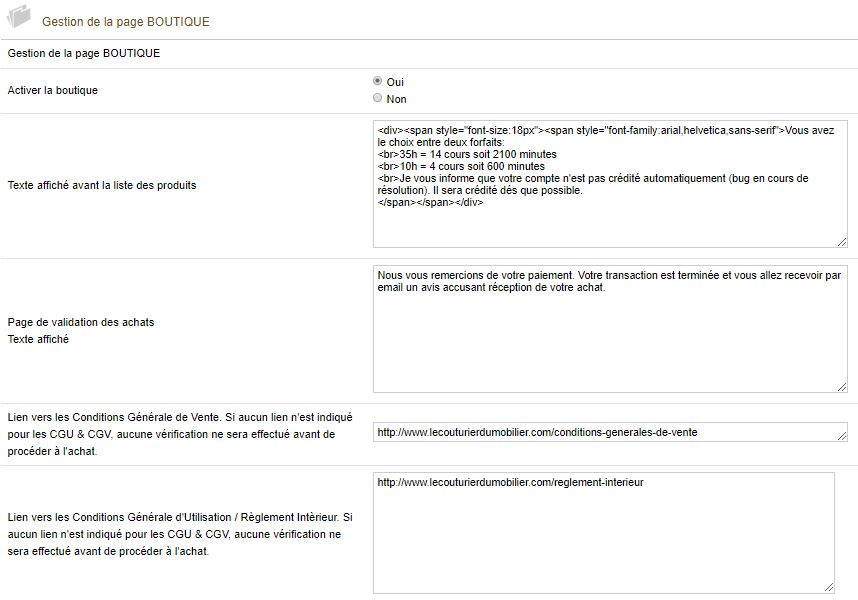
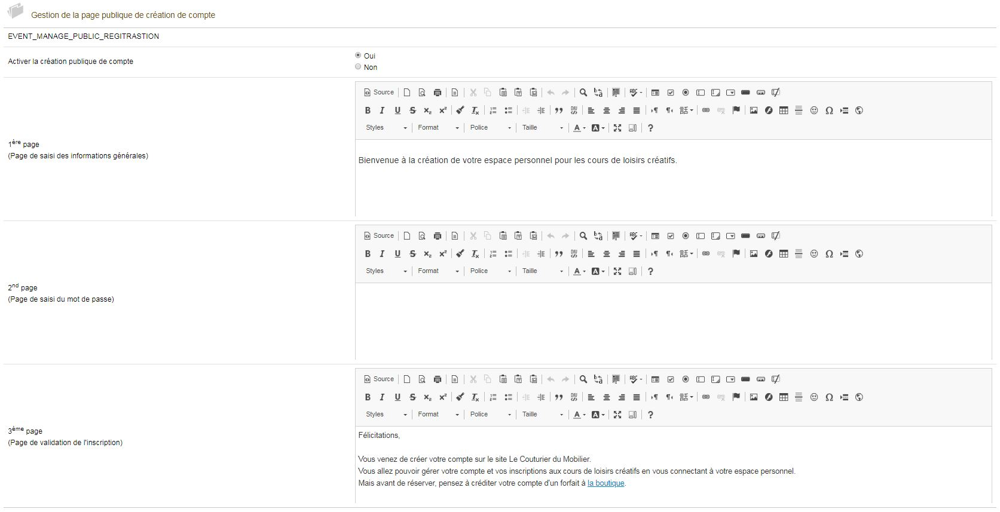
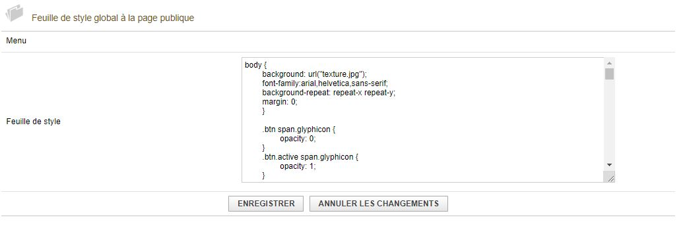
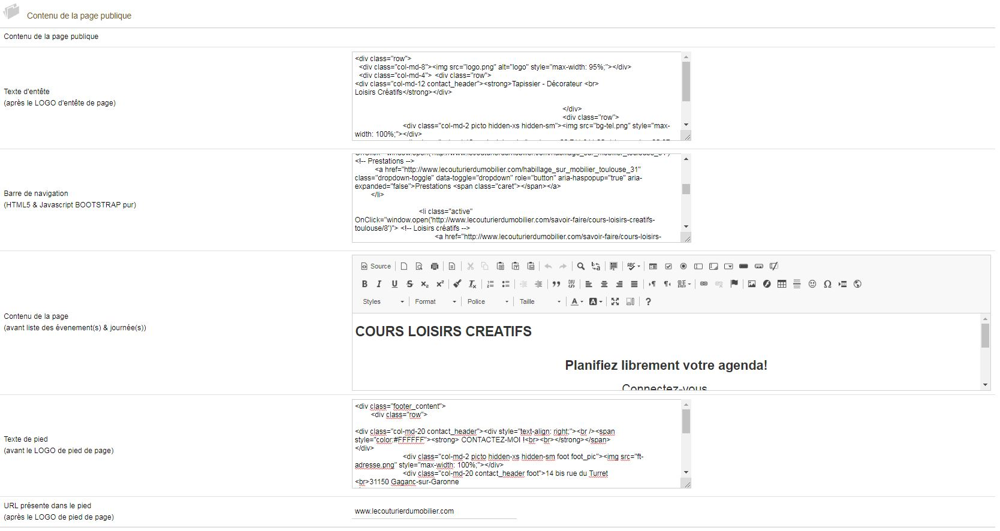
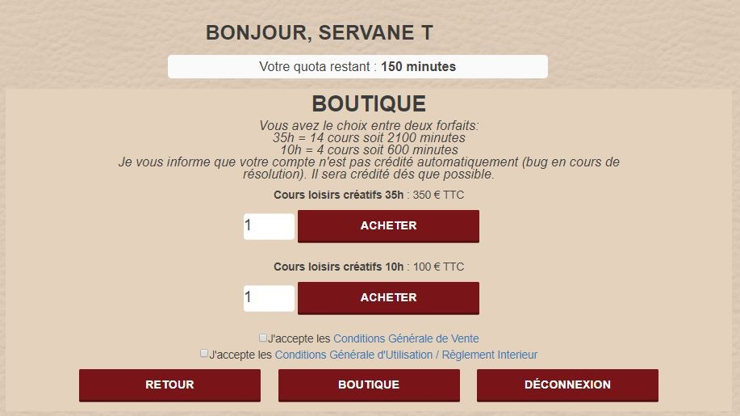
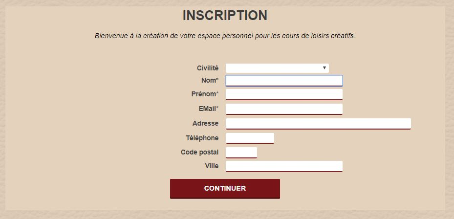

#Fonctionnement
Les pages publique du module se décomposent en plusieurs fonctionnalités permettant à l'utilisateur d'effectuer de nombreuses tâches. On peut parametrer ces fonctionnalités via le panneau d'administration, dans "Gestion page publique". Vous trouverez donc ainsi des informations pour vous aider sur le parametrage du module, puis des explications sur le contenu affiché dans les pages publique.
#Panneaux d'Administration
##Gestion de la boutique

1) Activer la boutique : Permet d'activer ou de désactiver l'achat d'objets via la page publique

2) Texte affiché avant la liste des produits : Permet d'afficher un texte de description des produits mis en vente dans la boutique

3) Lien vers les CGU : Si un lien est entré, l'utilisateur devra valider ces CGU pour pouvoir confirmer l'achat

4) Lien vers les CGV : Si un lien est entré, l'utilisateur devra valider ces CGV pour pouvoir confirmer l'achat

##Mail de la boutique

!!!!!!!!!!!!
Ces champs permettent de configurer le contenu du mail qui sera envoyé lors de l'achat d'un produit sur la boutique. Le mail peut contenir un lien pour valider le paiement sur paypal ou sur Stripe ou pour télécharger la facture.

##Comportement

 !!!!!!!!!!!
1) Activer la page publique : Permet de désactiver totalement la page publique, la boutique, la création de compte, la page d'inscription et l'acces publique au compte de l'utilisateur.

2) Afficher la barre de navigation : Permet d'implémenter un champ personnalisable pour y insérer une barre de navigation.

3)Afficher le nombre d'inscrit à la place du nombre de places disponible : Change l'affichage du nombre de place, Exemple : 2 / 5 places disponible = 3 / 5 personnes inscrite sur le nombre total défini.

4) Blocage des inscriptions / Désinscription : Permet d'empêcher un utilisateur de s'inscrire ou se désinscrire X heure(s) avant l'évènement.

##Création de Compte

1) Activer la création publique de compte : Permet de désactiver la possibilités aux utilisateurs non-inscrit de s'inscrire, via la page publique.

2)Champs 1ère, 2ème, 3ème page : Permer de personnaliser le message affiché à chaque étape de l'inscription.

##Feuille de Style

Ce menu permet d'éditer la feuille de style afin de personnaliser l'affichage des menus de pages publique.

##Contenu de la page publique

Ces menus permettent de modifier le contenu de la page publique

 !!!!!!!!!
1) Texte d'entête : Permet d'afficher un logo, un titre à la page

2) Barre de navigation : Permet d'insérer un contenu intermediaire entre l'entête et le contenu de la page, le plus souvent une barre de navigation

3) Contenu de la page : Permet de modifier le contenu présent avant l'affichage des inscriptions.

4) Texte de pied : Permet de modifier le texte présent en bas de page.

5) URL présente dans le pied : Permet de paramétrer l'URL du site (Site vers lequel sera dirigé l'utilisateur si les pages sont desactivés.)

##Gestion des relances

Ces paramètres permettent de configurer l'envoi des mails de relance, ces mails permettant le renvoi d'un mail de rappel à l'utilisateur inscrit ou invité.

#Vue de la page publique

Lorsqu'on est un utilisateur, on peut accéder à ces informations :

##Boutique

Après avoir accepté les CGU & CGV, et selectionné, un article, on accèse à la confirmation de notre achat.

##Achat Confirmé

Cliquer sur valider la commande permet d'accéder à l'interface de paiement.

##Menus de navigation
###Administrateur

Lorsqu'on est administrateur, on a acces au panneau d'administration (ADMIN), à la réservation et à la deconnexion.

Un administrateur ne peur pas utiliser la boutique et s'acheter lui-même des crédits.

 Il ne peut pas non plus s'inscrire à ses propre cours.

###Utilisateur

Un utilisateur n'a pas accès au panneau d'administration.

En revanche il peut accéder à la boutique

###Non-inscrit

Un utilisateur qui n'est pas connecté peut seulement se connecter ou créer son compte.

##Mon compte - Liste des factures

Cette page permet d'accéder à la liste des factures validées.

##Bas de page - Footer
 !!!!!!!

Ceci est le contenu de bas de page.

##Entête - Header
 !!!!!!

Ceci est le contenu de l'entête.

##Mon compte - Historique

Ceci est l'historique des cours auquel l'Utilisateur a participé.

##Inscription
###Administrateur
 !!!!!!!!

Un administrateur ne peut pas s'inscrire à un cours.

###Utilisateur

L'utilisateur peut s'inscrire et de désinscrire via cette interface (une inscription ou une désinscription à la fois).

##Création de compte
###Première page :

Tous ces champs doivent être remplis pour pouvoir accéder à la seconde étape de l'inscription.

###Deuxième Étape :
 !!!!!!!

Cette étape permet à l'utilisateur de choisir un mot de passe. Il pourra se loguer avec l'identifiant généré ou avec l'adresse mail.

###Troisième Étape :
 !!!!!!!!!!

Lorsque l'inscription est effectuée, on affiche un message et on invite l'utilisateur à se connecter.

##Inscription - Mon compte :
###Utilisateur

Ceci permet d'afficher le nombre d'unités de l'utilisateur, le coût des cours auquel l'utilisateur s'inscrit, et un lien pour acceder au compte.
###Administrateur

L'Administrateur n'ayant pas accès à l'inscription au cours, il ne peut qu'accéder aux informations du cours.
